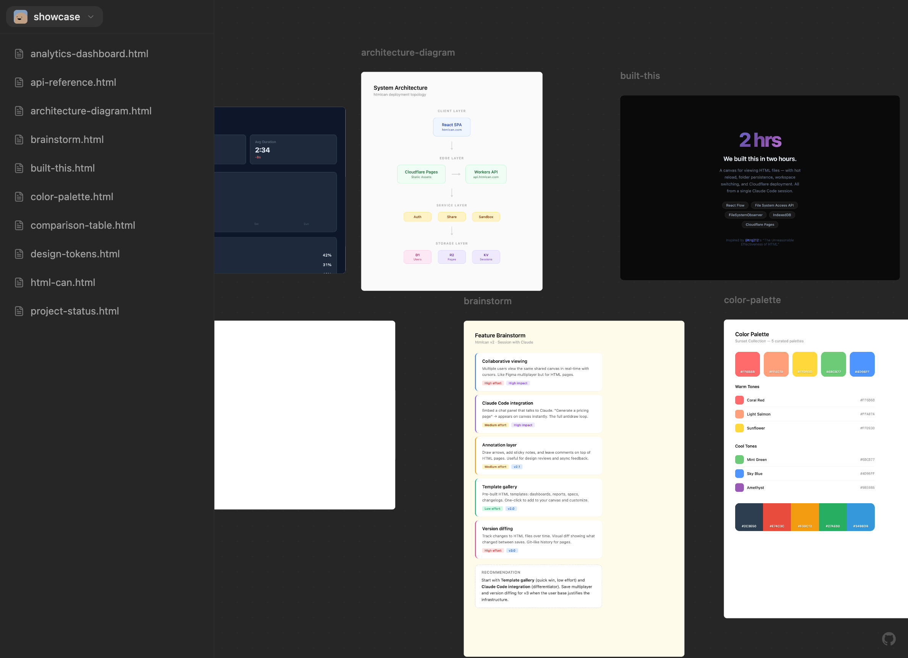

# htmlcan

**HTML Canvas** &nbsp;/&nbsp; **HTML Can** &nbsp;/&nbsp; **HTML fucking CAN, bro**

An infinite canvas for your HTML files.  
Open a folder. See every page. Edit — it updates live.

[Website](https://htmlcan.com) &nbsp;&middot;&nbsp; [GitHub](https://github.com/amk-dev/htmlcan)

  

---

HTML can do things markdown only dreams about — dashboards, interactive components, rich layouts, data visualizations. But previewing them means opening 15 tabs and alt-tabbing between files.

**htmlcan** gives you a canvas instead. Point it at a folder, and every `.html` file appears as a draggable, resizable, live-reloading card on an infinite 2D workspace.

## License

MIT
